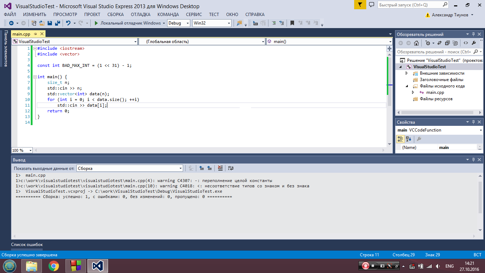
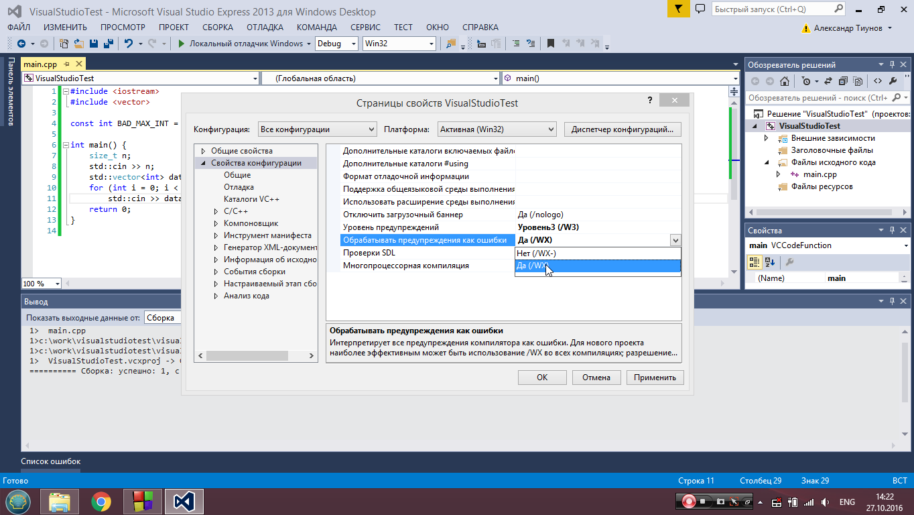
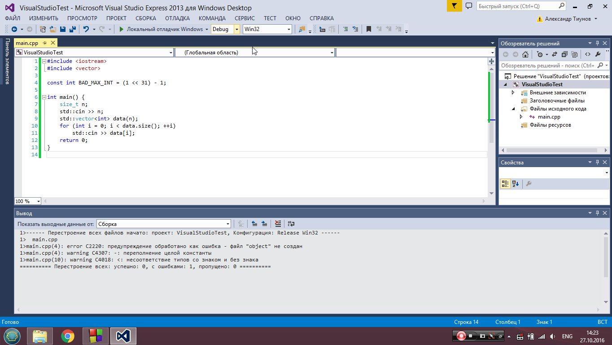
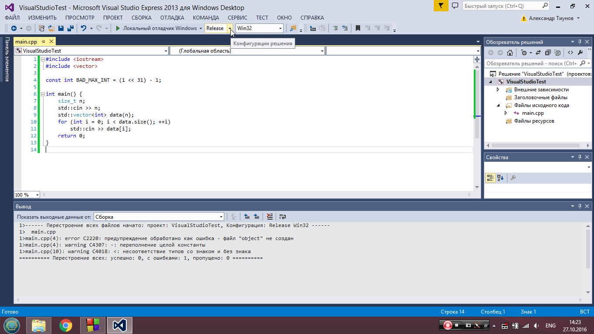
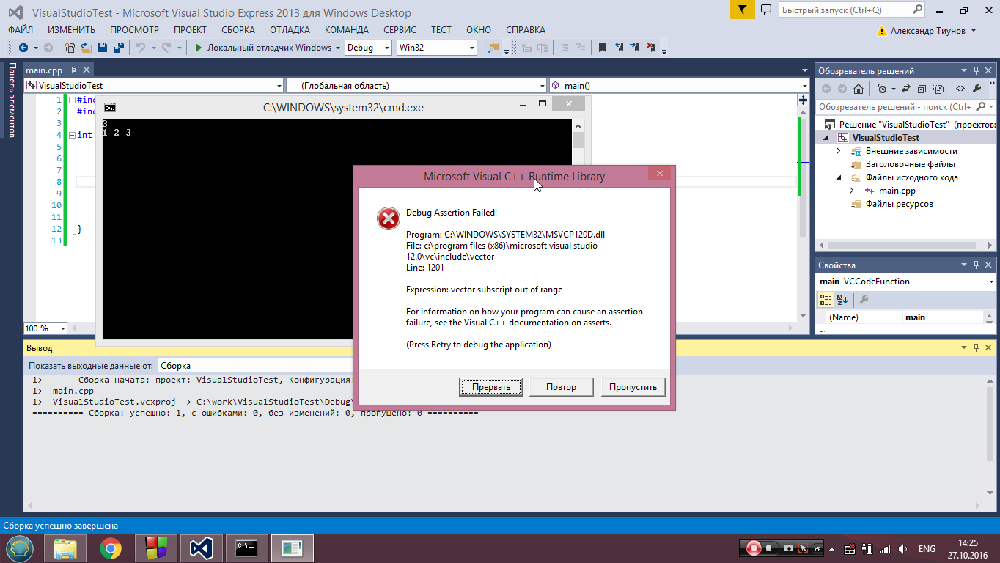
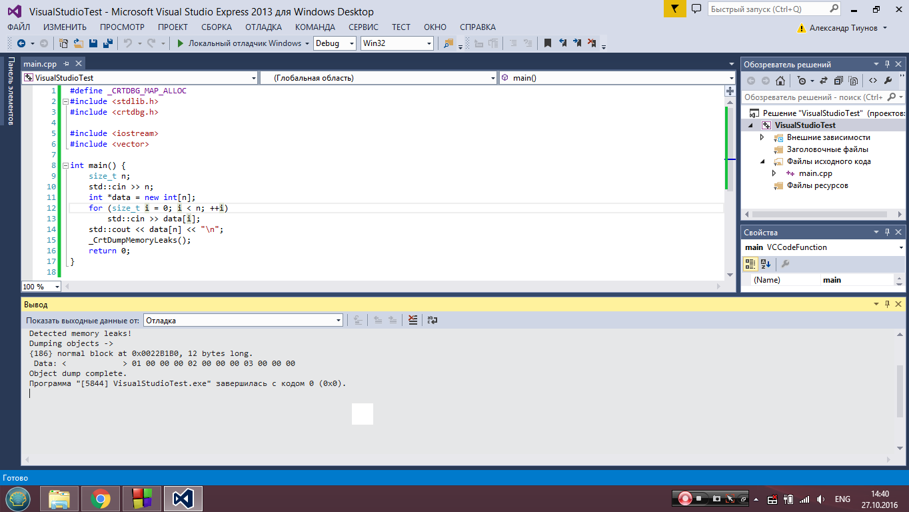

# Как настроить окружение на своем компьютере

## Введение

С недавнего времени на сервере используется новая схема тестирования решений, а точнее, отлавливается большее число ошибок за счет использования других ключей компиляции. Цель этой заметки &mdash; помочь вам получить такой же эффект на своей системе.

Помимо этого, описанные здесь рекомендации позволят вам организовать более качественное тестирование кода.

На сервере компилируется 2 варианта вашего решения, а именно:

```bash
g++-8 solution.cpp -std=c++17 -O2 -Wall -Werror -Wsign-compare -o fast_solution
g++-8 solution.cpp -fsanitize=address,undefined -fno-sanitize-recover=all -std=c++17 -O2 -Wall -Werror -Wsign-compare -o debug_solution
```

Здесь стоит отметить следующее:
1. `-Wall` и `-Werror`. Первый флаг заставляет компилятор выдавать дополнительные предупреждения, второй &mdash; трактовать любое предупреждение как ошибку компиляции. Таким образом, ваш код не должен давать ни одного предупреждения.
2. `-O2` включает оптимизации кода.
3. `-std=c++17` нужен для использования стандарта `C++17`. Если вы не особо обращаете внимание на используемый стандарт, то можете продолжать это делать и писать, как раньше. Остальные могут использовать все фишки нового стандарта.

Во втором случае решение компилируется с включенными *санитайзерами*. Любое обращение за пределы массива, знаковое переполнение целочисленных типов и любые подобные проявления некорректной работы с памятью и undefined behavior будут вызывать ошибку времени выполнения и приводить к вердикту Runtime Error на сервере, а не ситуации, когда ваша программа иногда работает, а иногда нет.

Обратите внимание, что `-fsanitize=address` также включает детектор утечек памяти. Поэтому, помимо контроля над тем, куда обращается ваша программа, на сервере также производится проверка, что в вашей программе нет утечек памяти (сделали `new` и не сделали `delete`). В подавляющем большинстве случаев вам вообще не нужно оперировать с динамической памятью вручную (например, для создания массивов используйте стандартные контейнеры вроде `std::vector`, которые правильно обращаются с памятью).

Поскольку санитайзеры вносят заметный оверхед в решение (значительно увеличивается потребляемая память и в несколько раз может возрасти время исполнения), то они используются только для запуска на маленьких тестах (обычно не более первых десяти в задаче), чтобы правильные решения не могли получить вердикты ML или TL.

## Примеры кода
Давайте рассмотрим на примерах, как работает компилятор с указанным выше набором флагов. В этом разделе приведены комментарии по поведению `gcc` и `clang` в linux с включенными санитайзерами. Про другие ОС см. секции ниже.

Здесь происходит знаковое переполнение при вычислении `BAD_MAX_INT`, что порождает соответствующее предупреждение. В десятой строке происходит сравнение `int` и `size_t`, что также порождает предупреждение. **Никогда** не игнорируйте это предупреждение: при таком сравнении `int` приводится к беззнаковому типу, таким образом, неравенство `-1 > size_t` всегда выполнено. Этот код не компилируется с флагом `-Werror`.
``` cpp
#include <iostream>
#include <vector>

const int BAD_MAX_INT = (1 << 31) - 1;

int main() {
    size_t n;
    std::cin >> n;
    std::vector<int> data(n);
    for (int i = 0; i < data.size(); ++i) {
        std::cin >> data[i];
    }
    return 0;
}
```

В этом примере происходит очевидный выход за пределы массива. Если заменить динамический массив на `std::vector`, произойдет то же самое. И `gcc`, и `clang` успешно отловят данную ошибку с включенными санитайзерами.
``` cpp
#include <iostream>
#include <vector>

int main() {
    size_t n;
    std::cin >> n;
    int *data = new int[n];
    for (size_t i = 0; i < n; ++i) {
        std::cin >> data[i];
    }
    std::cout << data[n] << "\n";
    delete[] data;
    return 0;
}
```

В этом примере есть утечка памяти (нет `delete[]`)
``` cpp
#include <iostream>
#include <vector>

int main() {
    size_t n;
    std::cin >> n;
    int *data = new int[n];
    for (size_t i = 0; i < n; ++i) {
        std::cin >> data[i];
    }
    return 0;
}
```

Здесь возникает `undefined behavior` при переполнении (введем `2000000000 2000000000`), который отловят и `clang` и `gcc` с включенным флагом `-fsanitize=undefined`.
``` cpp
#include <iostream>

int main() {
    int a, b;
    std::cin >> a >> b;
    std::cout << a + b << "\n";
    return 0;
}
```

## Настройка на своей системе

Мы рекомендуем использовать среду Clion для разработки. Всем студентам ШАД предоставляется бесплатная лицензия, которую можно найти [здесь](https://lk.yandexdataschool.ru/learning/useful). Вы можете работать из любой ОС, однако добиться поведения, описанного выше, можно только
на Linux и Mac OS. Опыт показывает, что прохождение ШАДа с использованием Windows достаточно мучительно, поэтому лучше заранее озаботиться установкой Linux. Самый удобный вариант &mdash; развернуть VirtualBox. Если же у вас Windows 10, то еще одним вариантом будет установка [WSL](https://docs.microsoft.com/en-us/windows/wsl/install-win10) и [его интеграция с Clion](https://www.jetbrains.com/help/clion/how-to-use-wsl-development-environment-in-clion.html).

Ниже приведена инструкция для Clion.

Создайте новый проект, зайдите в File -> Settings -> Build,Execution,Deployment -> Cmake. Изначально там будет только один профиль Debug. Когда вы нажмете + добавится
профиль Release, который пригодится в дальнейшем. Добавьте еще один профиль, назовите его ASAN. В Cmake Options запишите
```
-DCMAKE_BUILD_TYPE=ASAN
``` 

Отредактируйте ваш `CmakeLists.txt`. Он будет выглядеть примерно так:
```cmake
cmake_minimum_required(VERSION 3.12)
project(my_project)

set(CMAKE_CXX_STANDARD 17)

set(CMAKE_CXX_FLAGS_ASAN "-g -fsanitize=address,undefined -fno-sanitize-recover=all"
        CACHE STRING "Compiler flags in asan build"
        FORCE)

add_executable(my_project main.cpp)
```

Теперь вы легко можете переключаться между разными видами сборок: Debug для пошагового дебага, Release для тестирования производительности, ASAN для запуска
с санитайзерами.

<details><summary>Windows</summary>

На Windows без использования WSL санитайзеры не работают. Вы точно так же можете использовать Clion, но поддержки asan там не будет (если только вы не настроили интеграцию с WSL, см. ссылки выше).

### Visual Studio
В Visual Studio полный аналог санитайзеров получить не получится (а именно, undefined), но эмулировать `-fsanitize=address` более-менее можно.

Для начала снова рассмотрим код с предупреждениями:




Зайдем в Проект -> Свойства. Дальше для всех конфигураций в свойствах конфигурации нужно выбрать следующий пункт:



Это аналог `-Werror` на сервере. Действительно, получаем ошибку компиляции:




То же самое и для конфигурации Release:




Рассмотрим теперь такой код:
``` cpp
#include <iostream>
#include <vector>

int main() {
    size_t n;
    std::cin >> n;
    std::vector<int> data(n);
    for (size_t i = 0; i < n; ++i) {
        std::cin >> data[i];
    }
    std::cout << data[n] << "\n";
    return 0;
}
```

Тут есть очевидный выход за границы массива. В Visual Studio в Debug режиме полностью проверяются все операции со стандартными контейнерами. Таким образом, запуск этого кода в Release отработает успешно, а вот в Debug вы получите примерно такую ошибку:




К сожалению, если вы используете просто динамическую память (см. пример кода 2), то даже в Debug режиме все отработает успешно. Это еще один повод использовать стандартные контейнеры.

Рассмотрим теперь третий пример, в котором происходит утечка памяти. В Visual Studio вы можете дописать в начало кода строки:
```cpp
#define _CRTDBG_MAP_ALLOC
#include <stdlib.h>
#include <crtdbg.h>
```

Перед выходом из программы (перед `return 0` в main например) добавьте строку
```cpp
_CrtDumpMemoryLeaks();
```

Программа по-прежнему будет завершаться успешно, но в поток ошибок будет выведено следующее сообщение:




Проверим с `delete[]`:


Также обязательно запускайте ваше решение в конфигурации Release, потому что при этом включается `-O2`, что может приводить к другому поведению вашей программы (и на сервере тоже) в случае наличия в ней багов.
</details>

<details><summary>Mac OS</summary>

По сравнению с Linux, на маке необходимо произвести ряд дополнительных действий, чтобы получить такое же поведение. Для начала обязательно установите `gcc` из `brew`, никогда не используйте системный `gcc`. Выполните

``` bash
brew install gcc
```

Чтобы проверить, что gcc установился правильно, выполните (10 нужно заменить на версию gсс, установленную brew):
``` bash
g++-10 --version  # выведет полную версию g++
which g++-10  # выведет полный путь к компилятору, например /usr/local/bin/g++-10
```

Далее необходимо прописать путь к новому компилятору в настройках Clion. Для этого зайдите в File -> Settings -> Build,Execution,Deployment -> Toolchains и в C++ compiler пропишите полный путь к компилятору.

Далее, **обратите внимание**, что по умолчанию под маком asan не включает проверку на утечки памяти. Чтобы этого избежать, добавьте строчку

```bash
export ASAN_OPTIONS=detect_leaks=1
```

в файл 
```
~/.MacOSX/environment.plist
```

Иногда на маках при компиляции с asanом может выпадать большое количество ошибок, не связанных с вашим кодом. В этом случае попробуйте добавить флаг `-fsanitize-undefined-trap-on-error` для asan-сборки (переменная `CMAKE_CXX_FLAGS_ASAN` в `CmakeLists.txt`).
</details>

## Проверка на соответствие стайлгайду и форматирование кода

Инструкция ниже для Linux и Mac OS.

Вам понадобятся утилиты clang-format и clang-tidy, они обычно есть в стандартных репозиториях (`apt-get install` или `brew install`). Для clang-format вы можете взять конфиг [отсюда](https://gitlab.com/slon/shad-cpp0/raw/master/.clang-format), а для clang-tidy
[отсюда](https://gitlab.com/slon/shad-cpp0/raw/master/.clang-tidy).

Положите эти файлы в директорию с кодом или в домашнюю директорию. Для форматирования кода выполните
```bash
clang-format -i main.cpp
```

Вы также можете настроить автоматическое форматирование кода с помощью этой утилиты в [clion](https://www.jetbrains.com/help/clion/clangformat-as-alternative-formatter.html).

Для дополнительных проверок на именование переменных, функций и прочего выполните
```bash
clang-tidy main.cpp -- -std=c++17
```